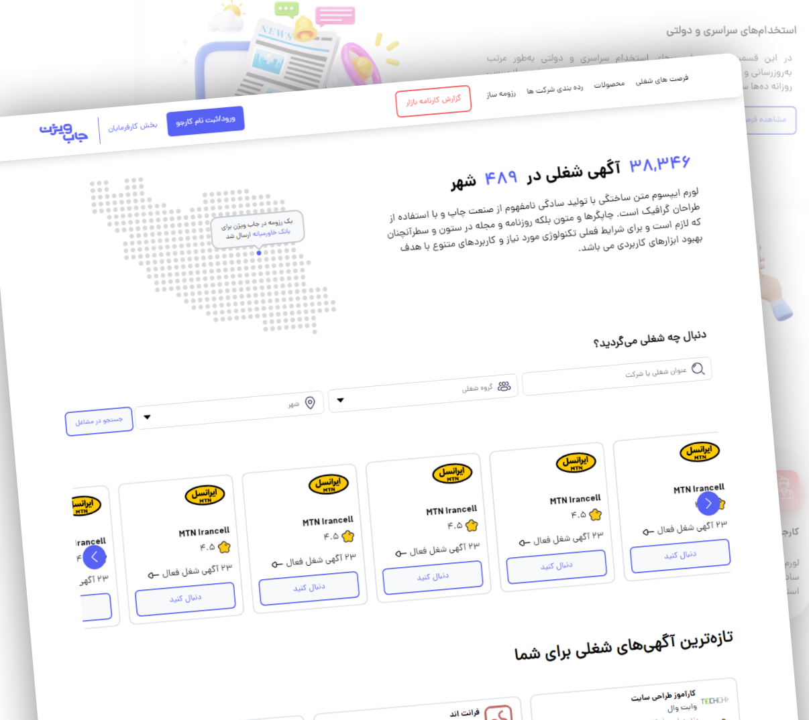

# JobVision Clone

The JobVision Clone project is a reproduction of the functionality and look of the jobvision.ir website using `React Typescript`.

## Table of Contents

1. [Description](#description)
2. [Installation](#installation)
3. [Usage](#usage)
4. [Features](#features)
5. [Contributing](#contributing)
6. [License](#license)

## Description

This project aims to replicate the functionality and design of the jobvision.ir website. It provides a platform for advertising companie's and add new one , build your own company and job's search

## Installation

To run this project locally, follow these steps:

## Usage

Once the dependencies are installed, you can start the development server:

Visit http://localhost:3000 in your web browser to see the JobVision Clone website.

## Features

-   [Feature 1]
-   [Feature 2]
    ...

## Contributing

We welcome contributions! Feel free to submit a pull request or open an issue.

## License

This project is licensed under the [insert chosen license, such as MIT] License - see the [LICENSE.md](LICENSE.md) file for details.
